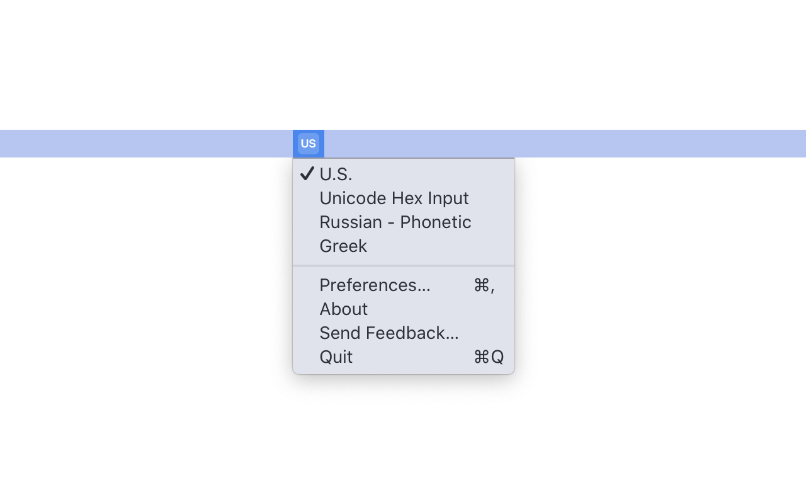

# Input Sources

> Switch your keyboard layout with a click

macOS provides an input source menu by default. I don’t like it because it displays the flag of the keyboard layout you’re using which is distracting. It also doesn’t let you quickly change the keyboard layout.

This app replaces the default menu (not really, you have to remove the system one. Functionally, it does though).

Click the menu bar icon to switch to the next keyboard layout. Option-, Control-, or right-click the menu bar icon to get a list of keyboard layouts and the option to quit the app.

Hit Control+Space in any app to switch the keyboard layout.

(If you want me to add configuration options, [send me a DM](https://twitter.com/jed_fox1) and I’ll consider it)
